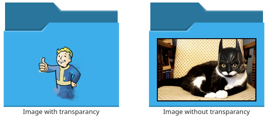
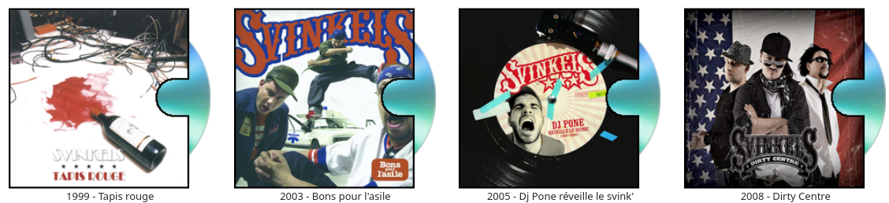
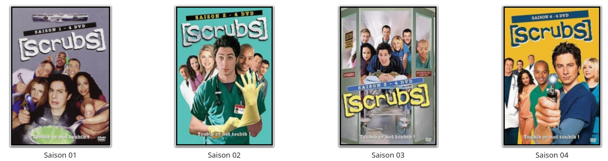
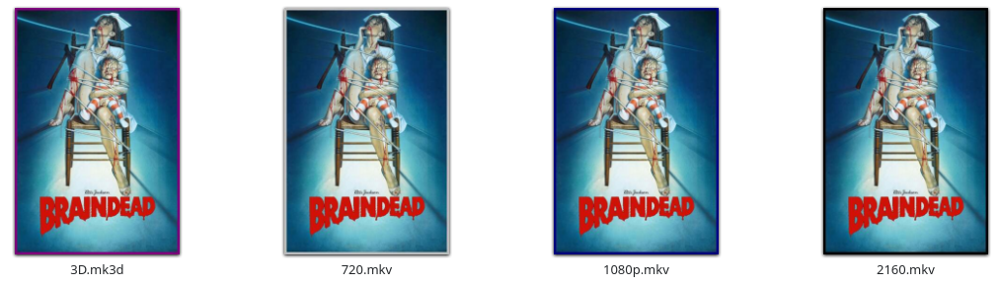

# keneric

## Version Française :
Si ça ne fonctionne pas avec le navigateur Dolphin, supprimer le groupe [PreviewSettings] du fichier ~/.config/dolphinrc.

### Description :
keneric est un générateur de vignettes pour plasma KDE5 qui utilise un script (bash ou python) pour créer ces vignettes.

Il a été créé par Rog131 <samrog131@hotmail.com>.

Voici les modifications apportées :
 - Le nom de la vignette temporaire est maintenant le hash md5 du fichier de la vignette finale.
 - Le script exécuté a été renommé de stripPicture à keneric.
 - L'utilisation d'un fichier conf est maintenant ajoutée.

### Installation :
#### Depuis les sources :
Pour les dérivés d'Ubuntu, la compilation necessite les paquets : **cmake extra-cmake-modules libkf5kio-dev build-essential kio-dev**.

Une fois dans le dossier, le plus simple est de procéder ainsi :
```
mkdir builddir
cd builddir
cmake ..
sudo make install
```
Le fichier **/usr/lib/x86_64-linux-gnu/qt5/plugins/keneric.so** est créé.

#### Depuis le binaire :
Extraire le binaire du fichier tar.gz : **https://github.com/Hizoka76/keneric/releases/latest**.

Le déplacer dans le dossier **/usr/lib/x86_64-linux-gnu/qt5/plugins/**.

#### Depuis le dépôt :
Installer le ppa pour les dérivés d'Ubuntu et installé le paquet :
```
sudo add-apt-repository ppa:hizo/service-menus
sudo apt-get update
sudo apt install keneric
```

### Principe de fonctionnement :
#### Fichiers desktop:
Ces fichiers font le lien entre le navigateur de fichier (comme Dolphin ou Konqueror) et keneric.

Lorsque le navigateur verra un élément au mimetype déclaré dans un de ces fichiers desktop, il appelera keneric afin qu'il lui fournisse une vignette.

Ils doivent être placés dans un dossier défini par la commande :
```
kf5-config --path services
```
Des fichiers desktop d'exemples sont visibles dans le dossier desktop des sources ici-présentes.

#### Fichier keneric.so :
Voir ci-dessus pour son installation.

Il appelle le script keneric et attent que celui-ci lui rende la main et lui fournisse une vignette.

Si la vignette est valide, elle sera chargée et fournie au navigateur de fichier qui l'affichera.

La vignette temporaire fournie par le script est supprimée.

Une vignette finale est créée dans le dossier cache.

#### Script keneric :
Ce script est appelé par keneric.so qui lui fourni les arguments suivants :
 - Le fichier en attente de vignette.
 - Le mimetype du fichier en attente de vignette.
 - L'emplacement et le nom de la vignette que doit être retourner à keneric.so.

   => Le nom de la vignette est le même que celui qui sera utilisé pour la vignette finale.

Le script doit être placé dans un dossier du path :
```
echo "$PATH"
```

#### Scripts sourcés par keneric :
Afin de faciliter le développement de nouvelles possibilités, keneric source des sous-scripts.
Toutes les explications sur le fonctionnement des sous-scripts dans le [dossier script](scripts).


#### Fichier keneric.conf :
Fichier ~/.config/keneric.conf.
Il est utilisé par keneric.so et par le script keneric.

Toutes les informations sur le fichier dans le [dossier config](config)


### Exemples :
#### Script Directory-Covert : Avec un fichier cover dans le dossier.


#### Script Directory-Disk : Avec un fichier disk dans le dossier.


#### Script Directory-Full : Avec un fichier full dans le dossier.


#### Script Video-mkv-Cover : Avec un fichier une image dans un fichier mkv.
La couleur du contour s'adapte à la résolution de la vidéo et en cas de 3D.


### Services :
 - Le dossier KenericHashFile présente un service menu copiant le hash d'un élément.
 - Le dossier KenericRemoveThumbnails présente un service menu supprimant les vignettes d'éléments.
 - Le dossier KenericCustomIcon présente un service menu facilitant l'utilisation de vignettes personnalisées.
 - Le dossier KenericDeleteCustomIcon présente un service menu facilitant la suppression de vignettes personnalisées.


## English version:
If it doesn't work with the Dolphin browser, remove the [PreviewSettings] group from the ~/.config/dolphinrc file.

### Description:
keneric is a thumbnail generator for KDE5 plasma that uses a script (bash or python) to create these thumbnails.

It was created by Rog131 <samrog131@hotmail.com>.

Here are the changes made:
 - The name of the temporary thumbnail is now the md5 hash of the final thumbnail file.
 - The script being run has been renamed from stripPicture to keneric.
 - The use of a conf file is now added.

### Installation:
#### From source:
For Ubuntu derivatives, the compilation requires the packages: **cmake extra-cmake-modules libkf5kio-dev build-essential kio-dev**.

Once in the folder, the easiest way is to proceed as follows:
```
mkdir builddir
cd builddir
cmake ..
sudo make install
```
The file **/usr/lib/x86_64-linux-gnu/qt5/plugins/keneric.so** is created.

#### From the binary :
Extract the binary from the tar.gz file : **https://github.com/Hizoka76/keneric/releases/latest**.

Move it into the folder **/usr/lib/x86_64-linux-gnu/qt5/plugins/**.

#### From the repository :
Install the ppa for Ubuntu derivatives and install the package:
```
sudo add-apt-repository ppa:hizo/service-menus
sudo apt-get update
sudo apt install keneric
```

### How it works :
#### Desktop files:
These files are the link between the file browser (like Dolphin or Konqueror) and keneric.

When the browser sees an element with the declared mimetype in one of these desktop files, it will call keneric to provide a thumbnail.

They must be placed in a folder defined by the command :
```
kf5-config --path services
```
Example desktop files are visible in the desktop folder of the sources here.

#### File keneric.so :
See above for its installation.

It calls the keneric script and waits for it to give it a thumbnail.

If the thumbnail is valid, it will be loaded and provided to the file browser which will display it.

The temporary thumbnail provided by the script is deleted.

A final thumbnail is created in the cache folder.

#### keneric script:
This script is called by keneric.so which provides it with the following arguments:
 - The file waiting for the thumbnail.
 - The mimetype of the file waiting for the thumbnail.
 - The location and the name of the thumbnail that the script must provide to keneric.so.

   => The name of the thumbnail is the same as the one that will be used for the final thumbnail.

This script has no extension to allow the use of several languages like python or bash.

The script must be moved to a folder in the path :
```
echo "$PATH"
```

#### Scripts sourced by keneric :
To facilitate the development of new possibilities, keneric sources sub-scripts.
See [script folder](scripts) for a full explanation of how sub-scripts work.

#### File keneric.conf :
~/.config/keneric.conf file.
It is used by keneric.so and by the keneric script.

All information on the file in the [config folder](config).


### Examples:
#### Directory-Covert Script: With a cover file in the folder.


#### Directory-Disk Script: With a disk file in the folder.


#### Directory-Full Script: With a full file in the folder.


#### Video-mkv-Cover Script: With a file an image in an mkv file.
The color of the outline adapts to the resolution of the video and in case of 3D.


### Services:
 - The KenericHashFile folder presents a menu service copying the hash of an item.
 - The KenericRemoveThumbnails folder presents a menu service deleting thumbnails of items.
 - The KenericCustomIcon folder presents a menu service to facilitate the use of custom icons.
 - The KenericDeleteCustomIcon folder presents a menu service to facilitate the deletion of custom thumbnails.

